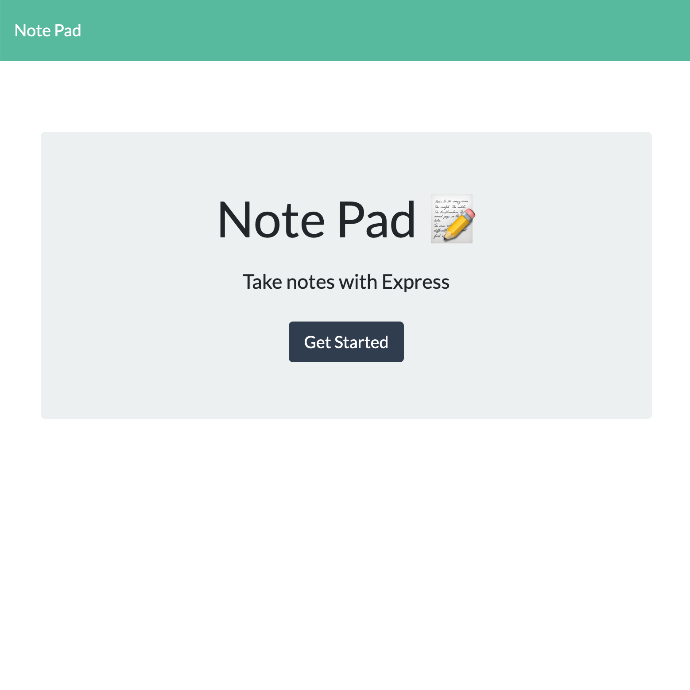

# Notepad

## Description
  This app can be used to write, save, view, and delete notes!  Thus, a user can easily organize their thoughts and keep track of tasks to be completed.  The application uses an Express.js backend and saves and retrieves note data from a JSON file. The app is deployed for use on Heroku.

[Link to project](https://agile-wildwood-21590.herokuapp.com/)

  

  

## Table of Contents
* [Installation](#Installation)
* [Usage](#Usage)
* [License](#License)
* [Contributing](#Contributing)
* [Tests](#Tests)
* [Questions](#Questions)
 
 
## Installation 
  No installation necessary.  Go to: https://agile-wildwood-21590.herokuapp.com/ and click the "Get Started" button to begin writing and saving notes! 

## Usage 
  The app allows users to create and save notes, view previously saved notes, and delete notes in order to keep track of important information and have written info readily available!

## License 

  This project is licensed under the ISC license. 

## Contributing   
 If you would like to contribute to this project or have feedback, please contact me below in the Questions Section.
***
 **Contributors:** erin-smith   
***

 

## Tests 
  Tests were run using --inquirer, console.log, nodemon and VSdebugger, as well as "throw err". The app has been tested locally and on Heroku.

## Questions:  
  

  If you have any questions about the repo, [open an issue](https://github.com/erin-smith/Notepad/issues/new) or contact me:  

* [My GitHub Profile](http://github.com/erin-smith)
* 
***
